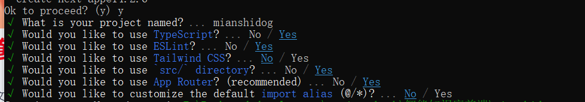
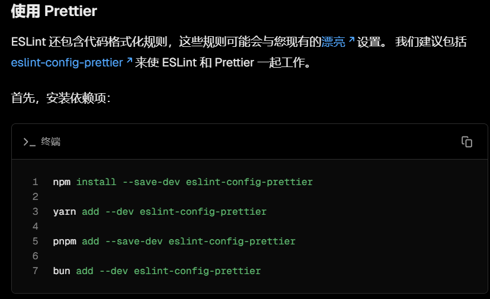
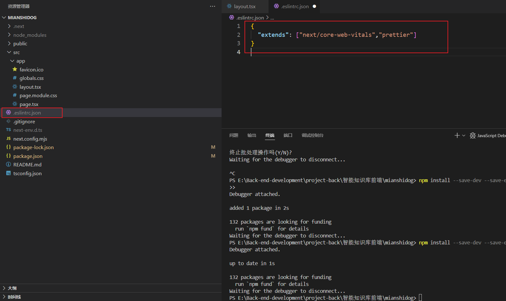
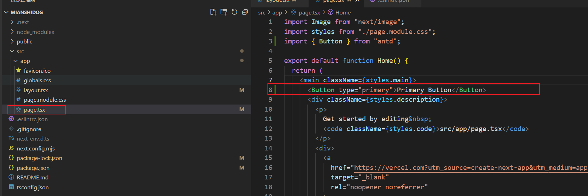
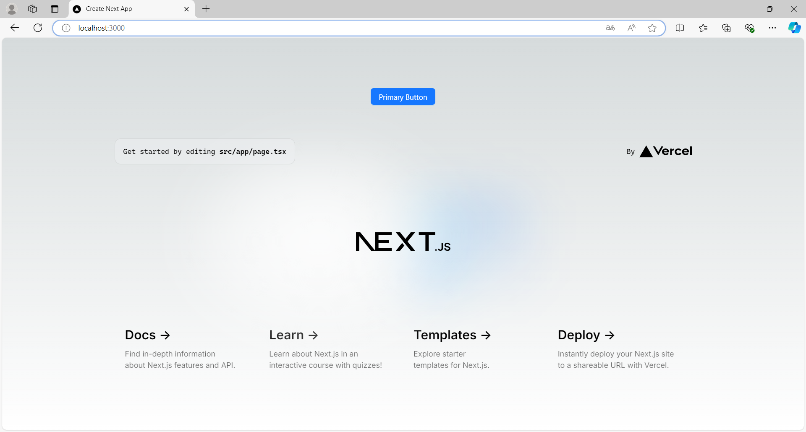

## 环境

Node 18.20.4

npm 9.6.6


next 14.2.6


# 前端模板开发

安装 next.js  14.2.6

[Getting Started: Installation | Next.js](https://nextjs.org/docs/app/getting-started/installation#automatic-installation)

```shell
npx create-next-app@14.2.6
```



查看package.json，脚本运行 npm run dev，正常运行。

## 前端工程化

脚手架已经帮我们配置了 ESLint 自动校验、TypeScript 类型校验，但一般情况下，我们还需要代码自动格式化插件 Prettier，需要手动整合。

整合多个工具时，很容易出现版本冲突的问题，尤其是 ESlint 和 Prettier 整合时，校验规则可能也会存在冲突。所以最好按照官方文档的指引，比如：https://nextjs.org/docs/app/building-your-application/configuring/eslint#prettiermrRDQyVmTD9YWb6cwYQeqbTVncLUY9b+gKIWt+A4MNQ=

先去官网安装 prettier（ https://prettier.io/docs/en/install ），执行命令：



```shell
npm install --save-dev --save-exact prettier
```

然后，添加到你现有的 ESLint 配置中：`prettier`



在任意一个 tsx 文件中执行格式化快捷键（Ctrl + Alt + L），不报错，表示配置工程化成功。

## 引入组件库

Ant Design 是 React 项目主流的组件库，Ant Design Procomponents 是在此基础上进一步封装的高级业务组件库

参考官方文档在 Next.js 项目中引入 Ant Design 5.x 版本的组件库：https://ant-design.antgroup.com/docs/react/use-with-next-cn

下载antd

```shell
npm install antd --save
```

使用appRouter 开发 引入优化

```shell
 npm install @ant-design/nextjs-registry --save
```

修改页面全局布局文件 `app/layout.tsx`：

```tsx
import { AntdRegistry } from "@ant-design/nextjs-registry";
import "./globals.css";

export default function RootLayout({
  children,
}: Readonly<{
  children: React.ReactNode;
}>) {
  return (
    <html lang="en">
      <body>
        <AntdRegistry>{children}</AntdRegistry>
      </body>
    </html>
  );
}

```

核心就是<AntdRegistry>{children}</AntdRegistry>

测试在page.tsx 随便引入一个antd组件





引入成功

注意，引入 Ant Design 后，不建议再引入 Tailwind CSS 了，可能会有样式冲突问题。

2）引入 Ant Design 后，我们还可以引入 Ant Design Procomponents，参考 [官方文档](https://procomponents.ant.design/docs) 执行下列命令即可：

```tsx
npm i @ant-design/pro-components --save
```

3）修改全局css

只保留

```css

* {
  box-sizing: border-box;
  padding: 0;
  margin: 0;
}

html,
body {
  max-width: 100vw;
  /* 最大高度100vh */
  max-height: 100vh;
}


```

