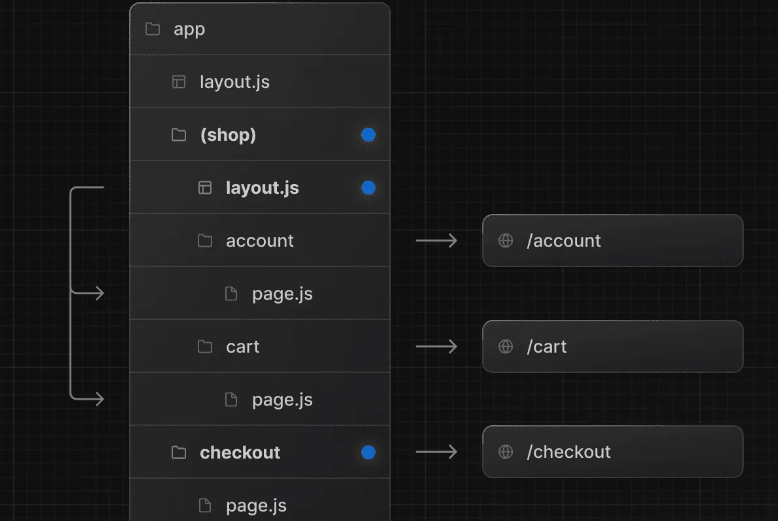

## 环境

Node 18.20.4

npm 9.6.6


next 14.2.6


# 前端模板开发

安装 next.js  14.2.6

[Getting Started: Installation | Next.js](https://nextjs.org/docs/app/getting-started/installation#automatic-installation)

```shell
npx create-next-app@14.2.6
```


查看package.json，脚本运行 npm run dev，正常运行。

## 前端工程化

脚手架已经帮我们配置了 ESLint 自动校验、TypeScript 类型校验，但一般情况下，我们还需要代码自动格式化插件 Prettier，需要手动整合。

整合多个工具时，很容易出现版本冲突的问题，尤其是 ESlint 和 Prettier 整合时，校验规则可能也会存在冲突。所以最好按照官方文档的指引，比如：https://nextjs.org/docs/app/building-your-application/configuring/eslint#prettiermrRDQyVmTD9YWb6cwYQeqbTVncLUY9b+gKIWt+A4MNQ=

先去官网安装 prettier（ https://prettier.io/docs/en/install ），执行命令：


```shell
npm install --save-dev --save-exact prettier
```

然后，添加到你现有的 ESLint 配置中：`prettier`


在任意一个 tsx 文件中执行格式化快捷键（Ctrl + Alt + L），不报错，表示配置工程化成功。

## 引入组件库

Ant Design 是 React 项目主流的组件库，Ant Design Procomponents 是在此基础上进一步封装的高级业务组件库

参考官方文档在 Next.js 项目中引入 Ant Design 5.x 版本的组件库：https://ant-design.antgroup.com/docs/react/use-with-next-cn

下载antd

```shell
npm install antd --save
```

使用appRouter 开发 引入优化

```shell
 npm install @ant-design/nextjs-registry --save
```

修改页面全局布局文件 `app/layout.tsx`：

```tsx
import { AntdRegistry } from "@ant-design/nextjs-registry";
import "./globals.css";

export default function RootLayout({
  children,
}: Readonly<{
  children: React.ReactNode;
}>) {
  return (
    <html lang="en">
      <body>
        <AntdRegistry>{children}</AntdRegistry>
      </body>
    </html>
  );
}

```

核心就是<AntdRegistry>{children}</AntdRegistry>

测试在page.tsx 随便引入一个antd组件


引入成功

注意，引入 Ant Design 后，不建议再引入 Tailwind CSS 了，可能会有样式冲突问题。

2）引入 Ant Design 后，我们还可以引入 Ant Design Procomponents，参考 [官方文档](https://procomponents.ant.design/docs) 执行下列命令即可：

```tsx
npm i @ant-design/pro-components --save
```

3）修改全局css

只保留

```css

* {
  box-sizing: border-box;
  padding: 0;
  margin: 0;
}

html,
body {
  max-width: 100vw;
  /* 最大高度100vh */
  max-height: 100vh;
}


```

## Next.js 开发规范

### 1.约定式路由

[Building Your Application: Routing | Next.js](https://nextjs.org/docs/app/building-your-application/routing)

Next.js 使用 **约定式路由**，根据文件夹的结构和名称，自动将对应的 URL 地址映射到页面文件。

1）基础规则：以 app 目录作为根路径，根据文件夹的名称和嵌套层级，自动映射为 URL 地址。注意，只有目录下直接包含 page 文件（js、jsx、ts、tsx 都支持），才会被识别为路由。


2）路由组：可以通过 `(xxx)` 语法，创建一个路由组，不会被转化为路径，可用于对路由进行分组管理，比如同组路由使用同一套布局。



3）动态路由：通过 `[xxx]` 语法，让多个不同参数的 URL 复用同一个页面，比如 `app/question/[questionId]/page.tsx` 中 questionId 就是动态路由参数，可以匹配 `/question/1`、`/question/2` 等 URL 地址，在页面中可以获取到 questionId 并加载不同的题目。


### 2.静态资源

[优化：静态资源 |Next.js](https://nextjs.org/docs/app/building-your-application/optimizing/static-assets)

Next.js 约定在 `/public` 目录下存放静态资源。在其中新建 assets 目录，可以在里面存放图片等静态资源文件，比如网站的 Logo。

```js
<Image src={`/assets/logo.png`} at={alt} width="64" height="64" />
```

注意，某些特殊的、常用的元信息文件不是放在 public 目录下，而是应该根据特定规则放在 app 目录下！

[File Conventions: Metadata Files | Next.js](https://nextjs.org/docs/app/api-reference/file-conventions/metadata)

比如将 favicon.ico 放到 app 的根目录下，可展示站点小图标：


将 robots.txt 放到 app 的根目录下，可用于告诉搜索引擎爬虫能否访问特定的页面、以及站点地图的地址，比如：

```txt
User-Agent: *
Allow: /
Disallow: /private/
```

### 3. 文件的组织形式

首先，项目中的每个页面和组件都是单独的文件夹。

基于 Next.js 的约定式路由，我们每个页面目录内需要添加 `page.tsx` 页面文件和 index.css 样式文件；每个组件目录内添加 `index.tsx` 页面文件和 index.css 样式文件。

对于项目中多页面公用的组件，放在 `src/components` 目录下；对于某个页面私有的组件，放在该页面的 components 目录下。

### 4.页面开发规范

Next.js 支持 React 的语法，可以用函数的方式声明页面和组件。每个页面的根元素必须有 id、每个组件根元素必须有 className，用于控制样式和快速定位。

**为了区分服务端和客户端渲染，每个页面（或组件）都必须在开头显示编写 "use client" 或 "use server"**

比如定义一个客户端渲染的页面，代码如下：

```tsx
"use client";
// 引入样式
import "./index.css";

// 主页
export default function HomePage() {
  return (
    <main id="homePage">
      <div>
        程序员鱼皮x编程导航的项目教程
      </div>
    </main>
  );
}
```

2）定义组件的时候，需要使用 TypeScript 声明组件属性的类型，比如：

```tsx
"use client";
import { Viewer } from "@bytemd/react";
import "./index.css";

interface Props {
  value?: string;
}

const MdViewer = (props: Props) => {
  const { value = "" } = props;

  return (
    <div className="md-viewer">
      <Viewer value={value} plugins={plugins} />
    </div>
  );
};

export default MdViewer;
```